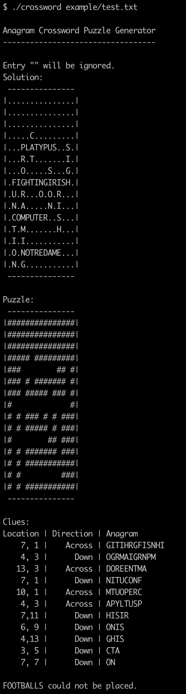

# Crossword-Generator
Given a list of words, will create a crossword anagram puzzle, with both the board and the anagram clues, that can be played on paper and pencil.

If no .txt file with words is provided then it will promt the user to enter the list of words to be used. The .txt files should be formated with a single word per line.

Example output:

